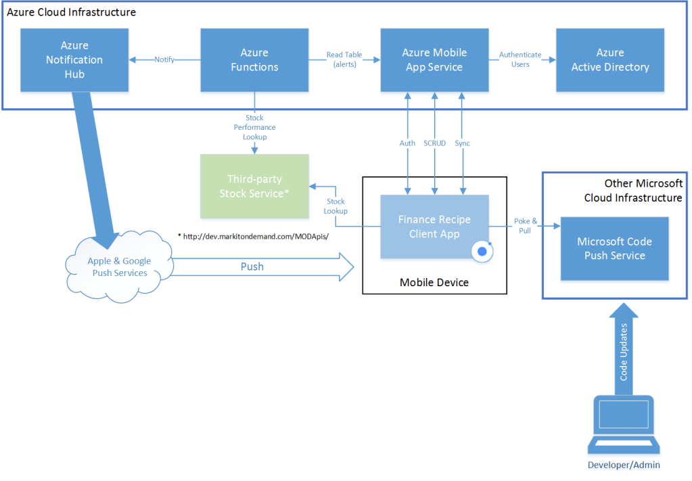
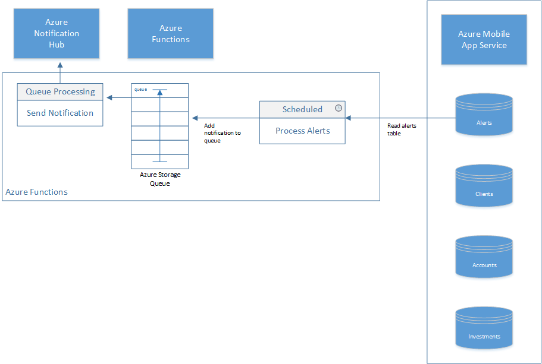

# TACO Finance Recipe

## Introduction 

The TACO Finance App Recipe sample application built using Visual Studio Tools for Apache Cordova, the Ionic Framework and multiple Azure cloud services. The application delivers capabilities a typical **financial advisor** might need when away from the office. The purpose of this recipe is to highlight best practices for developing mobile applications using Visual Studio, Apache Cordova and Ionic 2, while illustrating mechanisms for implementing the following: 

+ **Authentication & authorization**
+ **Secure communication** between client and server
+ **Secure local storage**
+ **Offline synchronization of data**
+ **Push notifications**
+ **Visualization of data** using graphs and/or charts
+ **Remote software updates**

## Overview

The recipe consists of a client application and a suite of back-end services that enable capabilities in the mobile application. For trial and demonstration purposes, the application can operate without the back-end services, but application capabilities will be limited.

### Client Application

The application addresses many of the requirements for a financial advisor, enabling investment managers to manage the following client-related content while away from the office: 

+ **Clients**: View a list of Clients plus add, edit and delete Client records.
+ **Accounts**: For each client, view a list of Accounts plus add, edit and delete client Account records. 
+ **Investments**: For each Account, view a list of Investments plus add, edit and delete Investment records.
+ **Research**: Lookup company stock information such as current price, high, and low values. Graph performance data over time and add alerts for selected stocks.
+ **Alerts**: Enables application users to configure the application to notify them when specific stock values increase or decrease beyond thresholds. 

The complete page flow (Ionic uses pages rather than screens for views) for the application is shown in the following figure:

You can learn more about the client-side application in the [client application readme file](FinanceAppIonic/readme.md).

### Back-end Application 

On the back-end, the application makes use of several Microsoft cloud services to deliver capabilities for the client application:

+ [Azure Active Directory](https://www.microsoft.com/en-us/cloud-platform/azure-active-directory) - Provides a cloud-based implementation of Microsoft Active Directory that application uses to authenticate users. 
+ [Azure Functions](https://azure.microsoft.com/en-us/services/functions/) - Manages the alerting capabilities of the app. 
+ [Azure Mobile App Service](https://azure.microsoft.com/en-us/services/app-service/mobile/) - Provides authentication services for the mobile application, data storage (using Azure Easy tables) and data synchronization (using offline data sync). 
+ [Azure Notification Hub](https://azure.microsoft.com/en-us/services/notification-hubs/) - Manages delivery of alert notifications to the mobile app.
+ [Microsoft Code Push](https://microsoft.github.io/code-push/) - Delivers application code updates over the air (OTA) from an administrator's command-line interface.

The interactions between the cloud services are highlighted in the following figure: 

#### Azure Mobile App Service

A mobile app defined in the Azure Mobile App Service provides the client application with a single access point for all of its data (online and offline), authentication, and other mobile capabilities. One of the key features of the service is Easy tables, mobile-friendly OData CRUD APIs backed by SQL Azure. Using Easy tables, the application exposes the following tables for use by the mobile client application:

+ Accounts
+ Alerts
+ Clients
+ Investments

Authentication for the mobile app is provided through Azure Active Directory, but exposed through the Azure Mobile App Service as part of it's client API. The client application uses the [Azure Mobile Apps Cordova plugin](https://github.com/Azure/azure-mobile-apps-cordova-client) to:

+ Login to the server
+ Access the Easy Tables (create, read, update, delete records)
+ Enable offline access    

#### Stock Alerts

The client application's Alerts capability enables users to manage stock alerts defined within the application. With this feature, users identify which stocks they're interested in monitoring and the price or performance thresholds that trigger a push notification to the application. Alerts data is stored in the Azure Mobile App Service Alerts Easy table. On the back-end, Alerts utilize [Azure Functions](https://azure.microsoft.com/en-us/services/functions/) and the [Azure Notification Hub](https://azure.microsoft.com/en-us/services/notification-hubs/) to manage processing and delivery of alerts to the user's mobile device. 

The following figure highlights how the alerting capability of the application operates.   

The app uses two Azure Functions: *Process Alerts* and *Send Notification*. The *Process Alerts* function reads the Alerts table and determines whether an alert threshold is met. For each alert, it looks up the stock's current price using a third-party stock service (described in the following section), and then checks stock prices against alert trigger thresholds. When a threshold has been exceeded, notifications are deposited in a queue for further processing.

The *Send Notification* function reads entries from the queue and submits a push notification request to the Azure Notification Hub for delivery through the target mobile platform's push notification service.  

#### Stock Service

The application currently uses a third-party stock lookup service from [Markit On Demand](http://dev.markitondemand.com/MODApis/) to provide stock and stock performance data for the application. The service is used to:

+ Search for specific companies - Used for research and alerting purposes
+ Retrieve immediate stock performance (price) data - Used for research and alerting purposes
+ Retrieve long term stock performance data - Used for graphing stock performance

The service is used by the client application as well as the Azure Functions **Process Alerts** function. 

## Application Files & Folders

+ `AzureFunctions` folder - Contains the source code files for the project's Azure Functions functions.
+ `docs` folder - Contains the Finance App Recipe workshop materials.
+ `FinanceAppIonic` folder - Houses the Finance App Recipe's client application.
+ `FinanceAppRecipe.sln` - A Microsoft Visual Studio solution file for the project; open this file in Visual Studio to work with the client application project.
+ `readme.md` - This file.
 
